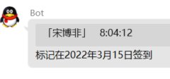

# ClassBot
服务于居家学习的Mirai插件
## 功能 & 计划
- [x] 签到
  - [ ] 定时生成未签到人员名单
## 用法
### 依赖
理论上，仅通过控制台可以访问插件的所有功能。但通常，为了便于利用上下文以简化指令，
会安装[chat-command](https://github.com/project-mirai/chat-command#%E5%AE%89%E8%A3%85chat-command) 。
### 权限管理
不同的群可以有不同的学员分布情况，因此Mirai的权限系统不能满足需求。

管理学员的权限分为两种：
* 插件权限`com.zhufucdev.plugin:*`
* 操作员`op`

后者由本插件定义，授予他人时需要同等或提升的权限。

因此，实际操作中，先使用控制台定义群操作员。例如：
```
# class op <Group ID>.<Member ID>
```
或者先授予用户Mirai机制下的权限，再设定操作员
```
# perm grant <User ID> com.zhufucdev.plugin:*
$ /class op <Member>
```
### 学员管理
学员分配是**群独立**的，意即不同的群对应不同的学员列表。

在获得权限之后，在目标群中执行：
```
$ /class classmate *
```
该指令会将所有群成员添加为学员。

也可以使用以下指令在构建列表时排除某些学员：
```
$ /class classmate *,!<Member>
```
对于脱离群上下文的操作员，可以用`.`指定目标群：
```
# class classmate <Group ID>.*
```
如果误添加，**单独**执行排除指令来排除异常：
```
$ /class classmate !<Member>
```
### 签到服务
在构建学员列表之后，插件将开始统计所有学员每日第一次发言。



操作员也可以主动将群成员标记为已签：
```
$ /class sign <Member>
```
随后，通过以下指令查看未签到人员名单：
```
$ /class signup
```
对于脱离群上下文的聊天，可以以下列方式指定群号：
```
# class signup <Group ID>
```